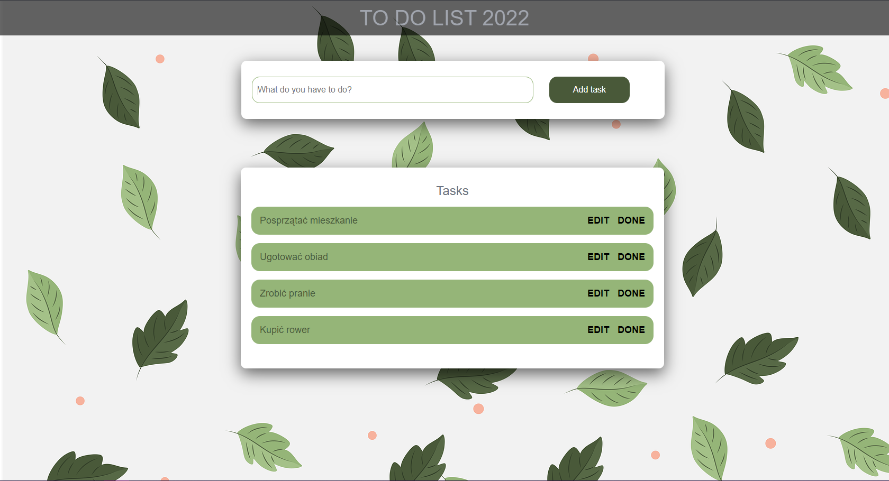

<table align="center">
    <tr>
        <td></td>
        </tr>
</table>

# TODO LIST :heavy_check_mark: :heavy_check_mark:

To visit page click https://manioo77.github.io/To-do-list-JavaScript/ or clone locally and follow instructions given below.

_Todolist jest pomocna przy organizacji zadań w ciągu danego dnia. Pozwala na dodawanie zadań, edycję, a po wykonaniu zadania na jego usunięcie z listy._

_Todolist is helpful in organizing tasks during the day. It allows you to add tasks, edit them, and after completing a task, remove it from the list._

## Screenshot of the working page

## To run project

- Install local http server `npm install -g live-server` - [website](https://www.npmjs.com/package/live-server).

- Then run using `live-server`

## Team :punch:

<table align="center">
  <tr>
   <td align="center"><a href="https://github.com/manioo77"> <b>Marek Mańka</b></a></td>
    </tr>
</table>
